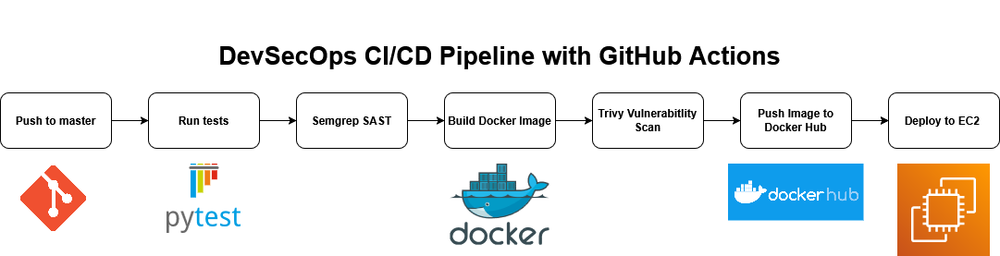

# Containerized Python Flask API with GitHub Actions CI/CD Pipeline

## Pipeline

The pipeline triggers on every push to master.

It automates the following, in order:
- Unit testing with PyTest
- Static application security testing (SAST) with Semgrep
- Docker image build
- Image vulnerability scanning with Trivy
- Image push to Docker Hub
- Deployment on an EC2 instance

## Vulnerability findings

### Semgrep (SAST)

| Finding | File | Severity | Resolution |
|---|---|---|---|
| Flask debug mode enabled | `app.py` | Blocking (Fails pipeline) | `debug=False` |
| Hardcoded `host="0.0.0.0"` | `app.py` | Blocking (Fails pipeline) | Replaced with env var |
| Container running as root | `Dockerfile` | Blocking (Fails pipeline) | Added non-root user `appuser` |

***Note :** Changed base image from python:3.11-slim (Debian-based) to python:3.11-alpine (lightweight) to avoid Debian package CVEs.*

### Trivy (Image Scanning)

| CVE | Package | Severity | Resolution |
|---|---|---|---|
| CVE-2025-69720 | ncurses | HIGH (Fails pipeline) | No fix available, suppressed with `ignore-unfixed: true` |
| CVE-2026-29111 | systemd | HIGH (Fails pipeline) | No fix available, suppressed with `ignore-unfixed: true` |
| CVE-2026-22184 | zlib | HIGH (Fails pipeline) | Fixed via `apk upgrade` |
| CVE-2026-24049 | wheel | HIGH (Fails pipeline) | Fixed via `pip install --upgrade wheel` |
| CVE-2026-23949 | jaraco.context | HIGH (Fails pipeline) | Fixed via `pip install --upgrade setuptools` |

