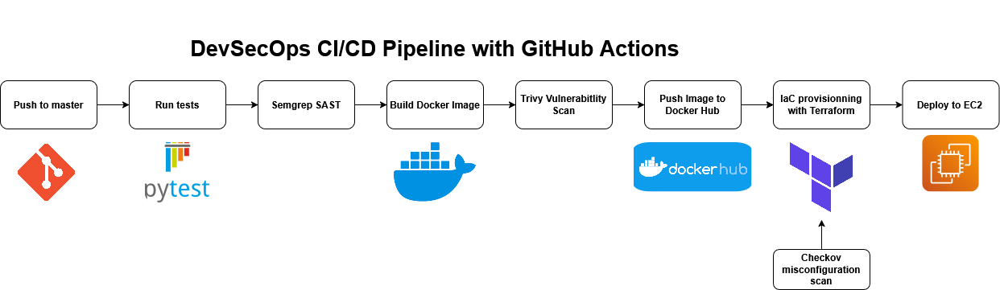

# Containerized Python Flask API with GitHub Actions CI/CD Pipeline

## Pipeline

The pipeline triggers on every push to master.

It automates the following, in order:
- Unit testing with PyTest
- Static application security testing (SAST) with Semgrep
- Docker image build
- Image vulnerability scanning with Trivy
- Image push to Docker Hub
- Scanning IaC files for misconfigurations with Checkov
- Infrastructure provisioning with Terraform
- Deployment on an EC2 instance

## Vulnerability findings

### Semgrep (SAST)

| Finding | File | Severity | Resolution |
|---|---|---|---|
| Flask debug mode enabled | `app.py` | Blocking | `debug=False` |
| Hardcoded `host="0.0.0.0"` | `app.py` | Blocking | Replaced with env var |
| Container running as root | `Dockerfile` | Blocking | Added non-root user `appuser` |

***Note :** Changed base image from python:3.11-slim (Debian-based) to python:3.11-alpine (lightweight) to avoid Debian package CVEs.*

### Trivy (Image Scanning)

| CVE | Package | Severity | Resolution |
|---|---|---|---|
| CVE-2025-69720 | ncurses | HIGH | No fix available, suppressed with `ignore-unfixed: true` |
| CVE-2026-29111 | systemd | HIGH | No fix available, suppressed with `ignore-unfixed: true` |
| CVE-2026-22184 | zlib | HIGH | Fixed via `apk upgrade` |
| CVE-2026-24049 | wheel | HIGH | Fixed via `pip install --upgrade wheel` |
| CVE-2026-23949 | jaraco.context | HIGH | Fixed via `pip install --upgrade setuptools` |

## Infrastructure misconfig findings

File : `main.tf`

| Rule | Description | Resolution |
|------|-------------|------------|
| CKV_AWS_135 | Ensure that EC2 is EBS optimized | ebs_optimized = true  |
| CKV_AWS_126 | Ensure that detailed monitoring is enabled for EC2 instances | monitoring = true |
| CKV_AWS_8 | Ensure all data stored in the Launch configuration or instance Elastic Blocks Store is securely encrypted |root_block_device { encrypted = true }|
| CKV_AWS_79 | Ensure Instance Metadata Service Version 1 is not enabled | metadata_options { http_tokens = "required" } |
| CKV_AWS_23 | Ensure every security group and rule has a description | Added descriptions |
| CKV_AWS_24 | Ensure no security groups allow ingress from 0.0.0.0:0 to port 22 | Skipped with `#checkov:skip=CKV_AWS_24: "skip"` |
| CKV_AWS_382 | Ensure no security groups allow egress from 0.0.0.0:0 to port -1 | Skipped with `#checkov:skip=CKV_AWS_382: "skip"` |
| CKV_AWS_260 | Ensure no security groups allow ingress from 0.0.0.0:0 to port 80 | Skipped with `#checkov:skip=CKV_AWS_260: "skip"` |

## TO DO:

In a production environment, the last three detections should be addressed and fixed :

`CKV_AWS_24` : Restrict to known IPs, or use SSM Session Manager 

`CKV_AWS_382` : Restrict egress only to what app needs (e.g. to call APIs...)

`CKV_AWS_260` : Either force HTTPS only, or keep HTTP but restrict to known IPs

